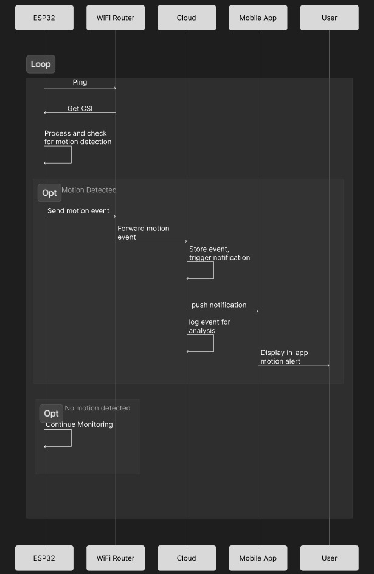

# **Human Detection with WiFi CSI**
## Detect human presence and movement in indoor environments using WiFi Channel State  Information (CSI), without rellying on cameras or wearable devices 

Traditional indoor monitoring systems rely on cameras and sensors, which raise privacy concerns, require line of sight, and increase hardware cost. There is a need for a privacy-preserving, low-cost indoor sensing system.

We use WiFi channel State Information (CSI) to analyze how WiFI signals change when a human is present or moving. These signal variations are processed to detect presence, movement paths, and room-level occupancy. 

## What is WiFi CSI?

WiFi CSI (Channel State Information) is detailed information about how a WiFi signal travels from a transmitter to a receiver. It describes the condition of the wireless channel by measuring signal strength, phase, and behavior of multiple subcarriers. When a human or object is present, the WiFi signal gets disturbed, and CSI captures these changes.

Channel state information (CSI) lays the foundation of most wireless sensing techniques, including Wi-Fi sensing, LTE sensing, and so on. CSI provides physical channel measurements in subcarrier-level granularity, and it can be easily accessed from the commodity Wi-Fi network interface controller (NIC).

### More Information
### [Click here for details](https://tns.thss.tsinghua.edu.cn/wst/docs/pre)
---

## How Human Detection Works
Human detection using Wifi CSI works by analyzing changes in WiFi Signal patterns. When a person enters or moves inside the WiFi coverage area, their body reflects and absorbs WiFi Signals. This causes variations in amplitude and phase of the CSI data. By monitoring these variations, the system can detect whether a human is present or not.

#### Step-by-Step Working

- WiFi transmitter sends signals

- Signals reflect from walls, furniture, and humans

- Receiver collects CSI data

- CSI changes are analyzed

- Presence & movement inferred

# **Data Flow Diagram**

# **UML Sequence Diagram**

# **What New Things Will Be Added or Improved in Round 2**
An Android application is integrated with the system to provide remote monitoring and real-time interaction. The mobile app acts as a user interface that receives system updates and notifications, allowing users to stay informed without direct access to the hardware or backend.

## Push Notification Integration

Push notifications are implemented to provide asynchronous communication between the backend and the Android application. When the backend detects a system-level event, a notification request is generated and delivered to the Android client using a cloud-based messaging service.

## Scalability & Future Scope

The current Android integration serves as a foundation for future improvements. The system architecture supports scalability, allowing additional functionalities, enhanced data visualization, and advanced interaction mechanisms to be incorporated as the project evolves.